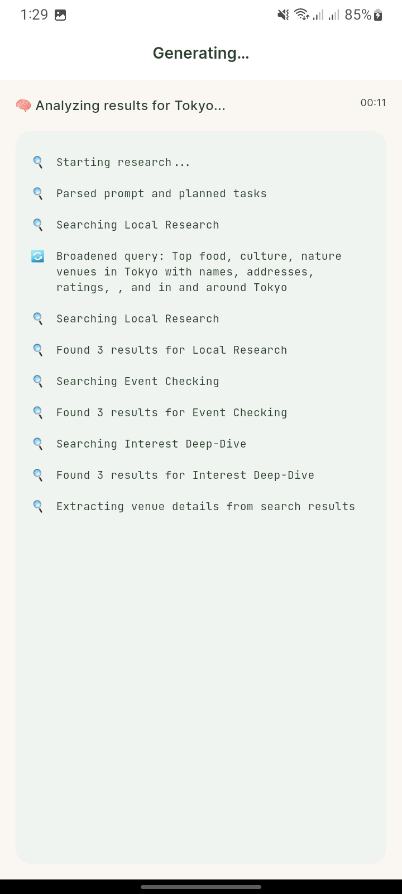
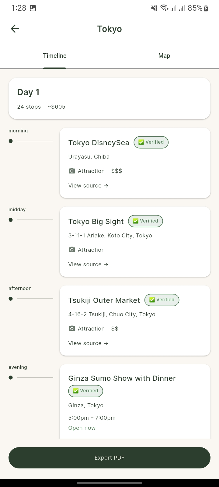
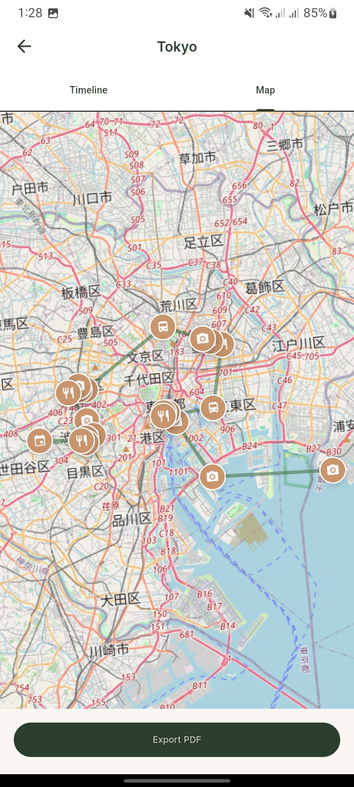

<p align="center">
  
</p>

<h1 align="center">NomadAgent</h1>

<p align="center">
  <strong>Describe your trip in plain language, watch AI research it in real time, and receive a verified itinerary.</strong>
</p>

<p align="center">
  <a href="#features">Features</a> •
  <a href="#tech-stack">Tech Stack</a> •
  <a href="#architecture">Architecture</a> •
  <a href="#getting-started">Getting Started</a> •
  <a href="#contributing">Contributing</a> •
  <a href="#license">License</a>
</p>

<p align="center">
  
  
  
  
</p>

---

## Overview

NomadAgent is an AI-powered travel research agent that turns natural-language trip descriptions into fully verified itineraries. You describe where you want to go, what you're interested in, and how long you're staying — then watch in real time as the agent plans research tasks, searches the web, extracts structured venue data, and compiles a day-by-day itinerary with coordinates, opening hours, and source citations.

Built with a Flutter mobile frontend and a Python FastAPI backend powered by LangGraph and Google Gemini, NomadAgent demonstrates how agentic AI pipelines can solve real-world planning problems end to end.

## Features

- **Natural Language Trip Input** — Describe your trip in plain English; the agent parses destination, duration, and interests automatically
- **Multi-Step Agent Pipeline** — LangGraph orchestrates a `planner → researcher → extractor → compiler` workflow with full state management
- **Real-Time Streaming** — Server-Sent Events (SSE) stream thought logs, venue verifications, and self-corrections to the app as they happen
- **Intelligent Web Research** — Tavily search with hybrid relevance scoring filters irrelevant results using confidence + destination keyword matching
- **LLM-Powered Data Extraction** — Gemini extracts structured venue data (coordinates, addresses, hours, descriptions) from raw web content
- **Venue Verification** — Tiered verification scoring with type-specific weight tables so nature venues aren't penalized for lacking opening hours
- **Interactive Map View** — Flutter Map renders all venues with accurate coordinates on an interactive OpenStreetMap layer
- **Day-by-Day Itinerary** — Compiled itinerary groups venues by day with travel logistics and time estimates
- **PDF Export & Sharing** — Generate and share polished PDF itineraries directly from the app
- **Parallel Extraction** — `asyncio.gather` runs concurrent LLM calls across venue tasks, cutting extraction time by ~60%
- **Bounded Event History** — Monotonic cursor + rolling buffer keeps streaming memory-bounded during long generations
- **Graceful Error Handling** — Failed search tasks and 503 errors are skipped without blocking the pipeline

## Demo

| Home Screen | Home with Prompt | Event Streaming | Itinerary View | Map View |
|:-:|:-:|:-:|:-:|:-:|
|  |  |  |  |  |

**Video Demo:** Full end-to-end generation for this test prompt:

> *"I'm planning a weekend trip to Barcelona next month. I'm interested in food and history. I have 2 days and a budget of $500."*

**Generation time:** ~46 seconds (edited for brevity)

[Watch the demo video](https://github.com/user-attachments/assets/6308a101-fbd9-41d2-8bed-6347d2b9bdcc)

---

## Tech Stack

| Layer | Technology |
|---|---|
| **Mobile App** | Flutter 3.11+ · Dart · Riverpod · GoRouter · Flutter Map |
| **Backend API** | Python 3.10+ · FastAPI · Uvicorn · SSE-Starlette |
| **Agent Pipeline** | LangGraph · LangChain Google GenAI (Gemini) |
| **Web Search** | Tavily Python SDK |
| **Data Validation** | Pydantic v2 · Pydantic Settings |
| **Code Quality** | Ruff (linter + formatter) · Pytest · flutter_lints |

---

## Architecture

```
┌─────────────────────────────────────────────────────────┐
│                    Flutter Mobile App                    │
│         (Riverpod · GoRouter · Flutter Map)              │
│                                                         │
│  Home → Generation (SSE) → Itinerary → Map → PDF Export │
└────────────────────────┬────────────────────────────────┘
                         │ SSE (Server-Sent Events)
                         ▼
┌─────────────────────────────────────────────────────────┐
│                   FastAPI Backend                        │
│              POST /api/v1/generate                       │
│              GET  /api/v1/health                         │
├─────────────────────────────────────────────────────────┤
│                 LangGraph Agent Pipeline                 │
│                                                         │
│  ┌──────────┐   ┌────────────┐   ┌───────────┐         │
│  │ Planner  │──▶│ Researcher │──▶│ Extractor │         │
│  │ (Gemini) │   │  (Tavily)  │   │  (Gemini) │         │
│  └──────────┘   └────────────┘   └─────┬─────┘         │
│                                        │               │
│                                  ┌─────▼─────┐         │
│                                  │  Compiler  │         │
│                                  │  (Gemini)  │         │
│                                  └───────────┘         │
└─────────────────────────────────────────────────────────┘
```

**Pipeline flow:**
1. **Planner** — Parses the user prompt, identifies the destination, duration, and interest categories, then generates up to 3 focused research tasks
2. **Researcher** — Executes Tavily web searches for each task with relevance scoring and result deduplication
3. **Extractor** — Runs parallel Gemini calls to extract structured venue data (name, coordinates, address, hours, description, source URL) from raw search content
4. **Compiler** — Assembles verified venues into a day-by-day itinerary with logistics and time estimates

---

## Getting Started

### Prerequisites

1. [Python 3.10+](https://www.python.org/downloads/)
2. [Flutter SDK 3.11+](https://docs.flutter.dev/get-started/install)
3. [Android Studio](https://developer.android.com/studio) or [Xcode](https://developer.apple.com/xcode/) (for mobile emulators)
4. [Tavily API Key](https://tavily.com/) (for web search)
5. [Google Gemini API Key](https://aistudio.google.com/apikey) (for LLM extraction)

### Installation

1. **Clone the repository**

   ```bash
   git clone https://github.com/RusithHansana/nomad-agent.git
   cd nomad-agent
   ```

2. **Set up the backend**

   ```bash
   cd api
   python -m venv .venv
   source .venv/bin/activate
   pip install -r requirements.txt -r requirements-dev.txt

   # Or, if you have uv installed:
   # uv pip install -r requirements.txt -r requirements-dev.txt
   ```

3. **Configure backend environment variables**

   ```bash
   cp .env.example .env
   ```

   Edit `api/.env` and fill in your API keys. See [Configuration](#configuration) for details.

4. **Start the backend server**

   ```bash
   uvicorn src.main:app --reload --port 8000
   ```

   Verify: `curl http://localhost:8000/api/v1/health` → `{"status": "ok"}`

5. **Set up the mobile app**

   ```bash
   cd ../app
   cp .env.example .env
   ```

   Edit `app/.env` and set your API base URL and key.

6. **Run the app**

   ```bash
   # If using an Android emulator, forward the backend port:
   adb reverse tcp:8000 tcp:8000

   flutter pub get
   flutter run --dart-define-from-file=.env
   ```

---

## Configuration

### Backend (`api/.env`)

| Variable | Description | Default |
|---|---|---|
| `TAVILY_API_KEY` | API key for Tavily web search | — |
| `GEMINI_API_KEY` | API key for Google Gemini LLM | — |
| `APP_API_KEY` | Shared secret for client ↔ server auth | `change-me` |
| `LOG_LEVEL` | Logging verbosity (`DEBUG`, `INFO`, `WARNING`, `ERROR`) | `INFO` |

### Mobile App (`app/.env`)

| Variable | Description | Default |
|---|---|---|
| `API_BASE_URL` | Base URL for the backend API | `http://localhost:8000` |
| `API_KEY` | Shared secret matching the backend's `APP_API_KEY` | — |

---

## Project Structure

```
nomad-agent/
├── api/                        # Python FastAPI backend
│   ├── src/
│   │   ├── agent/              # LangGraph agent pipeline
│   │   │   ├── nodes/          # Pipeline nodes (planner, researcher, extractor, compiler)
│   │   │   ├── tools/          # Agent tool definitions
│   │   │   ├── graph.py        # LangGraph state graph definition
│   │   │   └── state.py        # Agent state & bounded event buffer
│   │   ├── api/                # FastAPI routes, middleware, dependencies
│   │   ├── models/             # Pydantic request/response/event models
│   │   ├── services/           # Generation orchestration & SSE streaming
│   │   ├── config.py           # Environment-based settings (Pydantic Settings)
│   │   └── main.py             # FastAPI application entry point
│   ├── tests/                  # Pytest test suite
│   ├── requirements.txt        # Production dependencies
│   └── requirements-dev.txt    # Dev dependencies (pytest, ruff, httpx)
├── app/                        # Flutter mobile application
│   ├── lib/
│   │   ├── core/               # Shared utilities (theme, routing, networking, models)
│   │   ├── features/           # Feature modules
│   │   │   ├── home/           # Home screen & trip input
│   │   │   ├── generation/     # Real-time generation view (SSE consumer)
│   │   │   ├── itinerary/      # Day-by-day itinerary display
│   │   │   ├── history/        # Past itinerary history
│   │   │   ├── pdf/            # PDF export & sharing
│   │   │   └── settings/       # App settings
│   │   ├── app.dart            # App root widget
│   │   └── main.dart           # Entry point
│   ├── assets/                 # Fonts and static assets
│   └── pubspec.yaml            # Flutter project manifest
└── docs/                       # Project documentation
    └── pipeline_analysis.md    # Detailed pipeline iteration analysis
```

---

## API Reference

| Method | Endpoint | Description | Auth |
|---|---|---|---|
| `GET` | `/api/v1/health` | Health check | None |
| `POST` | `/api/v1/generate` | Generate an itinerary from a prompt (SSE stream) | API Key |

### SSE Event Types

| Event | Description |
|---|---|
| `thought_log` | Agent reasoning / progress update |
| `venue_verified` | A venue has been verified with structured data |
| `self_correction` | Agent detected and corrected an issue |
| `itinerary_complete` | Final compiled itinerary payload |
| `error` | Pipeline error |

---

## Streaming: Bounded Event History + Cursor Deltas

NomadAgent streams real-time progress updates from the backend to the app using Server-Sent Events (SSE).
To keep streaming fast and memory-bounded during long generations, the backend uses a **bounded event buffer**
with a **monotonic cursor**.

### State Fields

The agent state includes:

- `events`: a rolling window (bounded list) of event payloads.
- `event_cursor`: a monotonic integer that increments once per appended event.
- `event_base_cursor`: the cursor value of `events[0]` (advances when the buffer trims old entries).

`EVENT_HISTORY_LIMIT` in `api/src/agent/state.py` controls the maximum number of events retained.

### Why This Exists

The earlier approach ("append to `events` forever and stream by list length") works for MVP load, but can:

- grow memory unbounded,
- increase per-update processing cost over time,
- break delta logic once old events are trimmed.

Cursor + base-cursor keeps the buffer bounded while still preserving a stable notion of "event order."

### Example (Trim-Safe Deltas)

Assume `EVENT_HISTORY_LIMIT = 3` and the backend has emitted 4 events total.

- Total emitted cursor: `event_cursor = 4`
- Oldest retained: `event_base_cursor = 2`
- Retained payloads: `events == [#2, #3, #4]`

If the streamer last sent cursor `2`, it can compute the correct list slice using:

`start_index = (last_sent_cursor + 1) - event_base_cursor`

and safely emit only `[#3, #4]`. If a client falls behind and `last_sent_cursor < event_base_cursor - 1`,
the streamer emits the current buffer window (best-effort catch-up).

---

## Pipeline Evolution

The itinerary extraction pipeline went through **5 iterative test runs** across 3 days, with each run exposing issues that were diagnosed from debug dumps and fixed before the next. This section documents the progression.

### The Initial Problem (Epic 4 Smoke Test)

After completing the Interactive Map View (Epic 4), the first on-device smoke test with real API data revealed that **every feature built in Epics 2–4 was effectively broken**:

- 🗺️ **Map was empty** — all venues had `(0, 0)` coordinates, filtered out by the defensive coordinate guard
- ⚠️ **Every venue showed "Unverified"** — the strict verification formula required opening hours, which Tavily never returns
- 📝 **Venue names were page titles** — e.g., *"THE 5 BEST Tokyo Food & Drink Festivals (2026) - Tripadvisor"*
- 📍 **Addresses contained raw HTML** — the compiler fell back to `raw_content` when no structured address existed

**Root cause**: The compiler assumed structured venue input, but Tavily returns raw web search results. The missing link was an **LLM extraction step** to parse structured venue data from raw search content.

### Fix 1: LLM Extraction Node (Test Runs 1–2)

Added a `gemini-2.5-flash-lite` extraction node between the researcher and compiler:

**Pipeline**: `planner → researcher → **extractor** → compiler`

| Metric | Before (Broken) | After Fix 1 |
|---|---|---|
| Venue count | Raw page titles | 8 → 15 venues |
| Coordinates | 0% | 0% ❌ (model limitation) |
| Addresses | Raw HTML | 25% → 33% |
| Source URLs | Random assignment | ✅ Accurate |

**Diagnosed from dumps**: Content truncation (`MAX_RAW_CONTENT_CHARS = 800`) was cutting off venue data before the LLM saw it. Increased to `6000`. Source URL attribution was index-based (round-robin), not semantic — switched to LLM-extracted `source_url`.

### Fix 2: Model Upgrade + Relevance Scoring (Test Runs 3–4)

Test Run 3 (Mirissa, Sri Lanka) exposed a **critical search failure** — Tavily returned New Jersey parks instead of Sri Lankan beaches. Test Run 4 upgraded to `gemini-3-flash-preview` but hit output truncation (only 2 venues from 25+ in sources).

**Fixes applied**:
- **Hybrid relevance scoring** — combines Tavily confidence (50%) with destination keyword matching (50%); results below 0.4 are filtered
- **Model upgrade** to `gemini-3-flash-preview` — resolved the coordinate extraction gap (0% → 100%)
- **Tiered verification** — type-specific weight tables so nature venues aren't penalized for lacking opening hours
- **Venue deduplication** — merge duplicates across search tasks, preferring richer data
- **Raw content noise reduction** — regex stripping of Markdown images, link targets, emojis, and navigation patterns

### Fix 3: Parallel Extraction + Noise Reduction (Test Run 5)

Profiling showed the extractor was the main bottleneck (~45–60s of ~90s total), running 3 independent LLM calls sequentially.

**Fixes applied**:
- **`asyncio.gather`** for concurrent LLM extraction across all venue tasks
- **Aggressive content cleaning** to reduce prompt token pressure
- **Graceful 503 handling** — failed tasks are skipped without blocking others

### Final Results (Test Run 5 vs Initial Smoke Test)

| Metric | Initial (Broken) | Final (Test 5) | Improvement |
|---|---|---|---|
| **Venues extracted** | 0 usable | **16** | ∞ |
| **Coordinates** | 0% | **100%** | Map fully populated |
| **Addresses** | Raw HTML | **100%** clean | 4× |
| **Opening hours** | 0% | **25%** | First non-zero |
| **Source URLs** | Random | **100%** accurate | Fully resolved |
| **Extraction time** | ~50s | **19.4s** | ~60% faster |
| **Verification** | 0% (all unverified) | Tiered scoring | Type-aware |
| **Error handling** | Crash on failure | Graceful degradation | 503-safe |

The full analysis with per-run breakdowns is in [`docs/pipeline_analysis.md`](docs/pipeline_analysis.md).

---

## Roadmap

- [x] Core agent pipeline (planner → researcher → extractor → compiler)
- [x] Real-time SSE streaming with bounded event history
- [x] Interactive map view with venue coordinates
- [x] PDF export and sharing
- [x] Hybrid relevance scoring and venue deduplication
- [x] Parallel LLM extraction
- [ ] User accounts and saved itineraries (cloud sync)
- [ ] Multi-language itinerary support
- [ ] Budget estimation per venue/day
- [ ] Hotel and transport recommendations

---

## Contributing

Contributions are always welcome!

Please read our [Contributing Guide](CONTRIBUTING.md) to learn about our development process, how to propose bugfixes and improvements, and how to build and test your changes.

This project has adopted the [Contributor Covenant Code of Conduct](CODE_OF_CONDUCT.md). By participating, you are expected to uphold this code.

---

## License

This project is licensed under the [MIT License](LICENSE).

---

## Acknowledgements

- [LangGraph](https://github.com/langchain-ai/langgraph) — Agent orchestration framework
- [Google Gemini](https://deepmind.google/technologies/gemini/) — Large language model powering extraction and compilation
- [Tavily](https://tavily.com/) — AI-optimized web search API
- [FastAPI](https://fastapi.tiangolo.com/) — High-performance Python web framework
- [Flutter](https://flutter.dev/) — Cross-platform mobile UI framework
- [Flutter Map](https://pub.dev/packages/flutter_map) — Interactive maps for Flutter
- [OpenStreetMap](https://www.openstreetmap.org/) — Map tile data

---

<p align="center">
  Built with ☕ by <a href="https://github.com/RusithHansana">RusithHansana</a>
</p>
